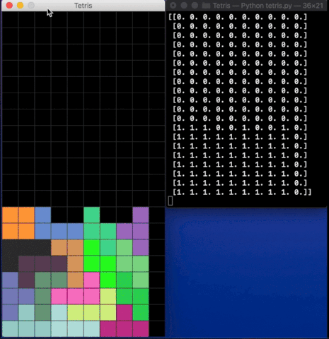

# Tetris
A Tetris clone written from scratch with Pygame and Numpy. The entire game is a one big matrix manipulation!



<kbd>&#8592;</kbd> - turn left
&#8594; - turn right
&#8593; - rotate
&#8595; - move the piece down
<kbd>&leftarrow;</kbd>

# Installation
- Python 3.6 or below
- Pygame
- Numpy

To run the game on your local machine, simply download the tetris.py file run the program.
```bash
python3 tetris.py
```
